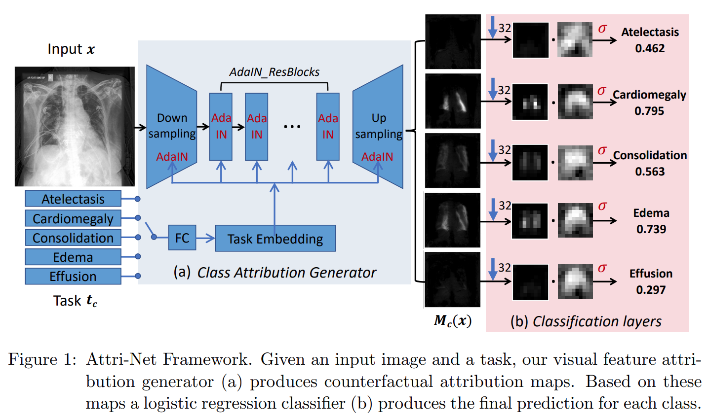
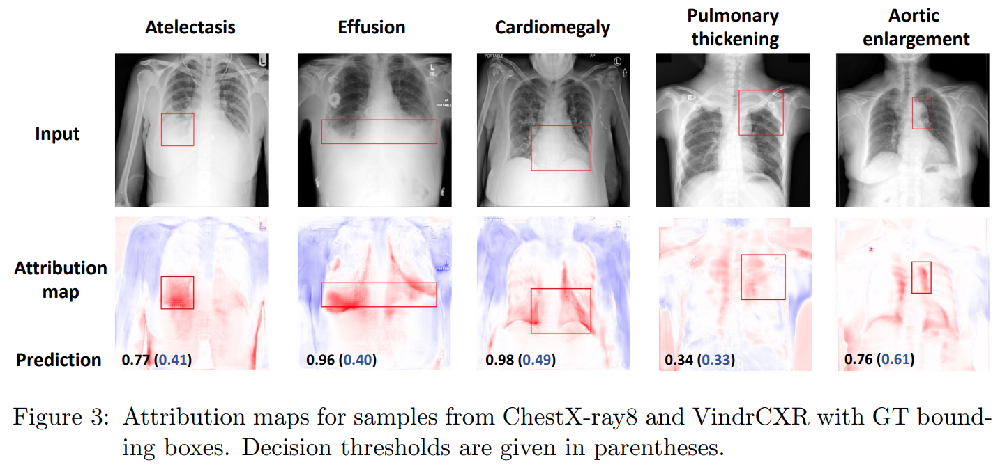
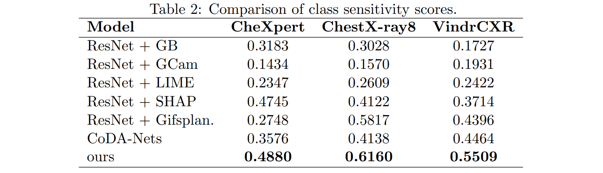

# Attri-Net
Official implementation for MIDL 2023 paper **Inherently Interpretable Multi-Label Classification of Chest X-rays Using Class-Specific Counterfactuals** [Arxiv Paper] (https://arxiv.org/abs/2303.00500)

## Model overview
<div style="displaystyle=block;align=center;"><p align="center" >
  
  </p>
</div>
## Results

### Qualitative evaluation
<div style="displaystyle=block;align=center;"><p align="center" >
  
  </p>
</div>
### Quantitative evaluation
<div style="displaystyle=block;align=center;"><p align="center" >
  
  </p>
</div>

## Installation
```
conda create -n attrinet python=3.10
pip install -r requirements.txt
```

## Datasets
We perform evaluations with the following three Chest X-ray datasets.

**CheXpert** (https://stanfordmlgroup.github.io/competitions/chexpert/)

**ChestX-ray8** (https://nihcc.app.box.com/v/ChestXray-NIHCC)

**VinDr-CXR** (https://vindr.ai/datasets/cxr)


## Other Models

We compared Attri-Net with the black model Resnet50 and an inherent interpretable model CoDA-Nets. We adapted the models slightly to our task settings (i.e the number of classes in the output is set to the number of diseases we trained on which is 5).

**Resnet50** We use the PyTorch implementation of [resnet50](https://pytorch.org/vision/stable/models.html) in torchvision.models subpackage without using pretrained weights.

**CoDA-Nets** We use the official implementation of [CoDA-Nets](https://github.com/moboehle/CoDA-Nets), and use the [default parameters](https://github.com/moboehle/CoDA-Nets/blob/master/experiments/Imagenet/final/experiment_parameters.py) of large model "9L-L-CoDA-SQ-100000" defined to train on Chest X-ray images. We remove the WarmUpLR scheduler for more stable training for ChestX-ray8 and VinDr-CXR datasets.


# References
If you use any of the code in this repository for your research, please cite as:
```
  @misc{sun2023inherently,
      title={Inherently Interpretable Multi-Label Classification Using Class-Specific Counterfactuals}, 
      author={Susu Sun and Stefano Woerner and Andreas Maier and Lisa M. Koch and Christian F. Baumgartner},
      year={2023},
      eprint={2303.00500},
      archivePrefix={arXiv},
      primaryClass={cs.CV}
}
```
